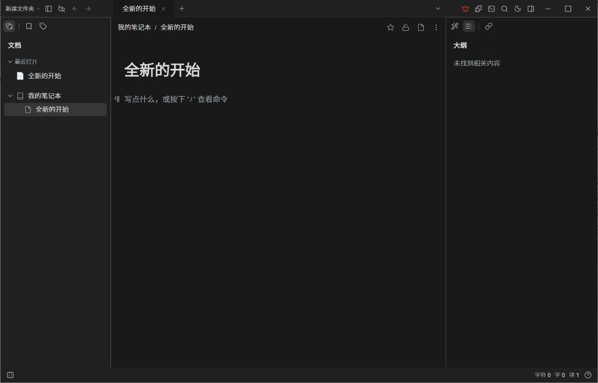
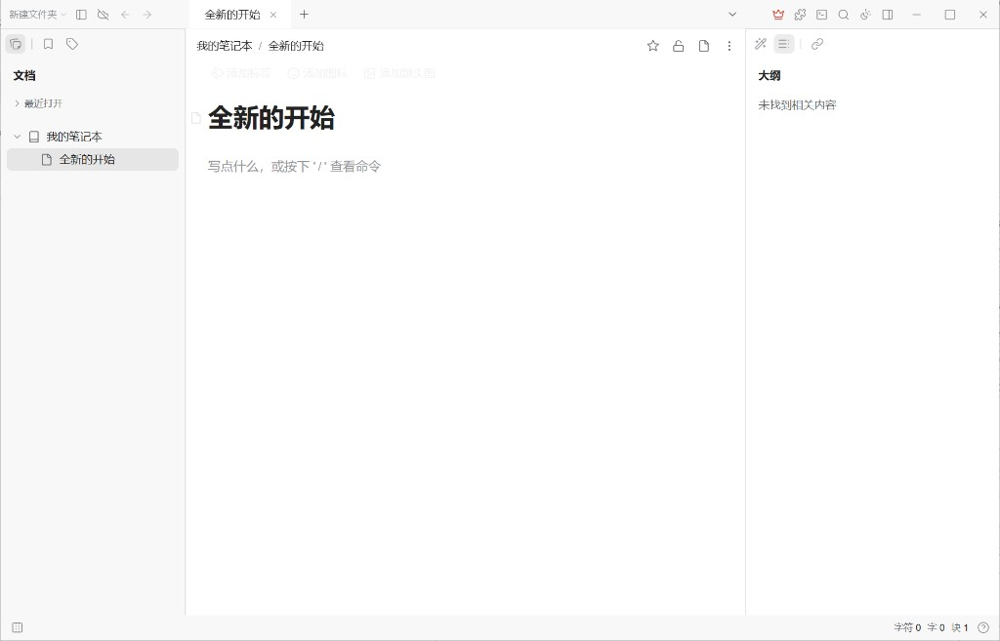
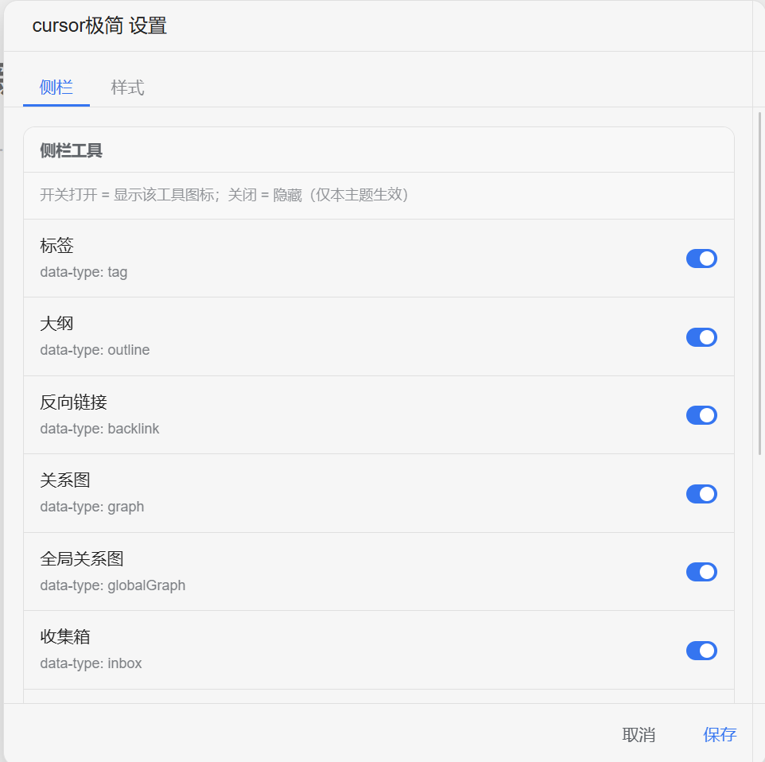
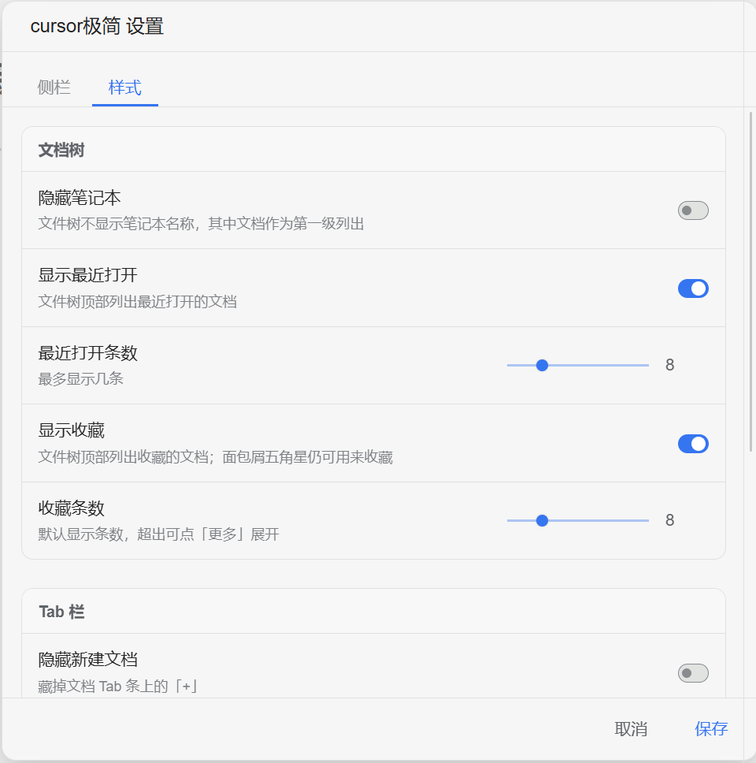
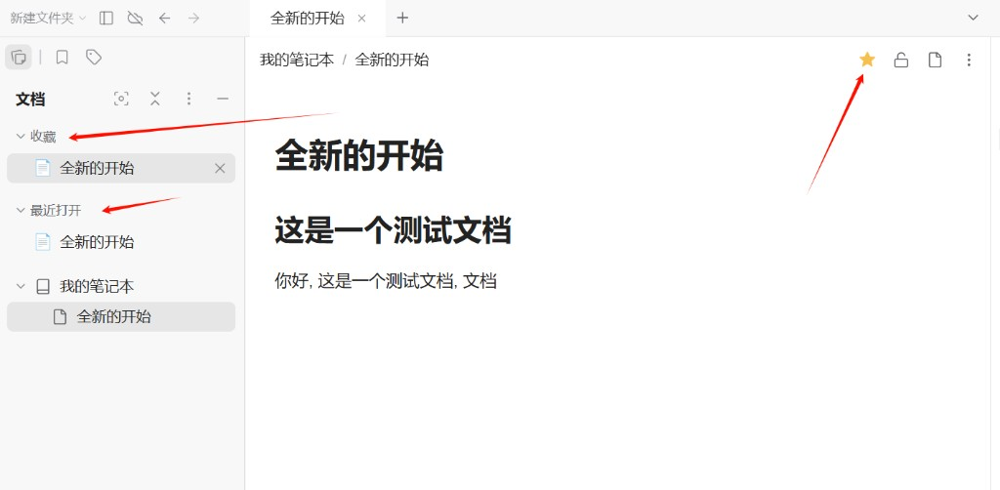
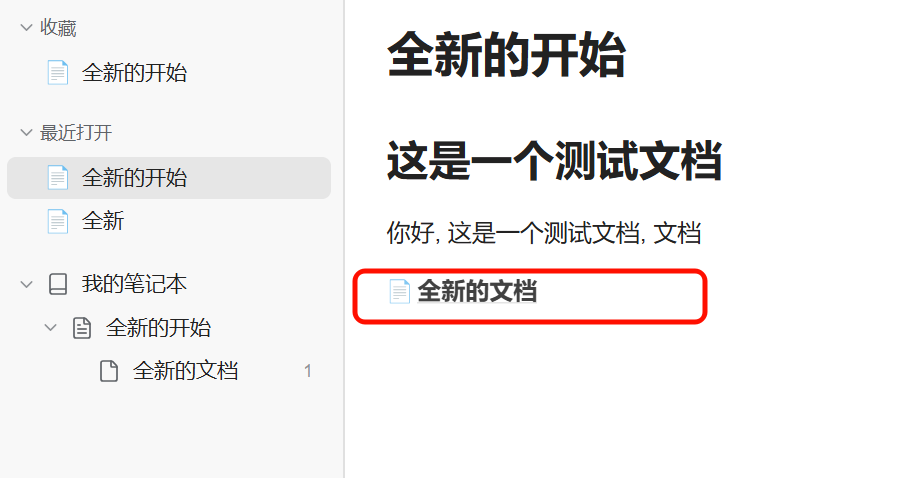
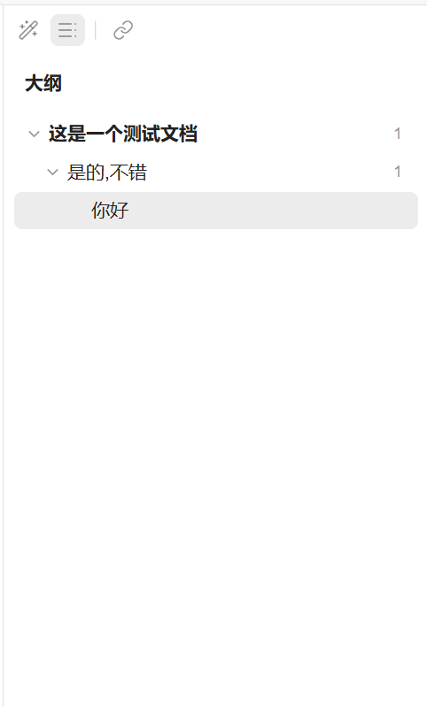

# cursor极简

A **minimal** SiYuan theme inspired by [Cursor](https://cursor.com) and [Notion](https://www.notion.so): four quiet regions, less chrome, easier to stay in the document.

Light mode overlays official **daylight**; dark mode overlays **midnight**. Colors stay on upstream tokens; this theme mainly changes layout and interaction.

Enable **cursor极简** for both light and dark themes under **Settings → Appearance**.

Interactive features (settings panel, favorites, recents, like button, top dock strip, etc.) ship in the companion plugin **[cursorart-tools](https://github.com/fyuanace/cursorart-tools)** — install and enable it together with this theme.

## Look

Dark and light both keep a clear sidebar / editor / outline split. Selection is a single soft highlight.

**Dark**

**Light**

## Features

### Hide sidebar tools

Plugins menu → **cursor极简工具**. Sidebar tab: adaptive title-bar height, dock-in-content, hide unused dock icons (cursorart theme only). Edit / slash / config-sync came from fhelper — disable fhelper. Every control applies immediately; there is no Save button.

### Favorites and recently opened

The file tree can show Favorites and Recently opened at the top. Star the current doc from the breadcrumb. Only the row you clicked stays highlighted. Deleted docs drop out of both lists.

### Document links

Block refs to documents show a doc icon and bold title, so they read as pages rather than plain text.

### Outline

The outline hides the document name and H1–H6 marks, bolds top-level headings, and follows the caret in the editor.

## Also included

- VS Code-like document tabs; optional hide of “new doc” and tab switcher
- Breadcrumb shows the document path
- Optional hide of notebook names so docs sit at the first tree level
- Plain table headers and adjustable block line height

## Changelog

### v2.0.4

- Title-bar height in pure CSS via DPI / `resolution` media queries (~55 device pixels)

### v2.0.3

- Removed `theme.js` for bazaar rules; interactions move to companion plugin [cursorart-tools](https://github.com/fyuanace/cursorart-tools)

### v2.0.2

- Theme marketplace icon updated to the Cursor app mark
- Settings label: reset like button (was donate)
- Donate/like flow refinements; DNS and support-page notes

### v2.0.1

First public product release.

- Minimal four-region layout on daylight / midnight
- Theme settings: dock icons, recents and favorites, hide notebooks, tab buttons, doc-ref style, table head, line height
- File-tree favorites and recents; single-row highlight; prune lists when a doc is deleted
- Doc-ref icons; quieter outline that follows the editor
- Path breadcrumb, VS Code-like tabs, top dock strip
